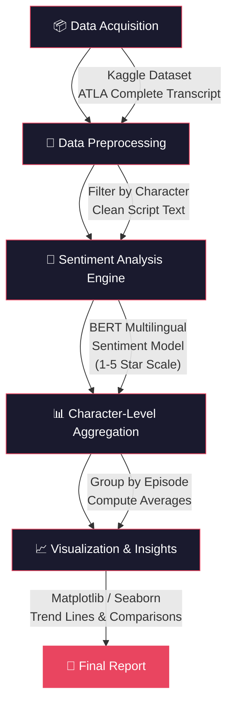
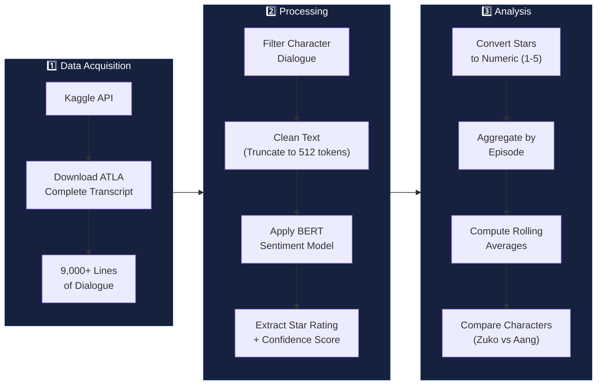
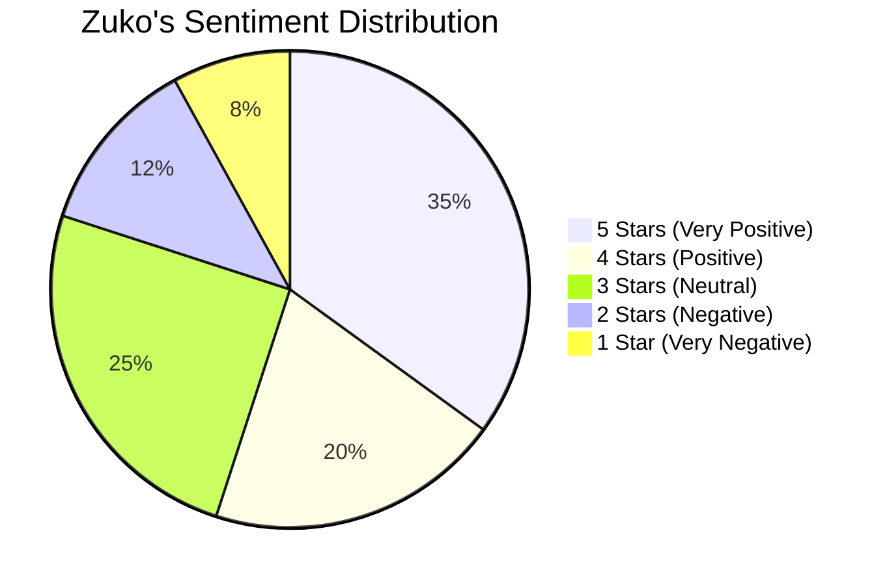

<p align="center">
  
  
  
  
</p>

<h1 align="center">🔥 ATLA Subtitle Sentiment Analyzer 🔥</h1>
<h3 align="center"><em>Quantifying Zuko's Redemption Arc Through Natural Language Processing</em></h3>

<br/>

<p align="center">
  <strong>A data-driven deep dive into the emotional journey of one of animation's most iconic characters.</strong>
</p>

<p align="center">
  This project applies state-of-the-art NLP sentiment analysis to the complete transcript of <i>Avatar: The Last Airbender</i>, tracking the emotional trajectory of Prince Zuko's dialogue across all three seasons to quantitatively reveal his legendary redemption arc.
</p>

---

## 📖 Table of Contents

- [Overview](#-overview)
- [Project Architecture](#-project-architecture)
- [Tech Stack](#-tech-stack)
- [Data Pipeline](#-data-pipeline)
- [Key Findings & Metrics](#-key-findings--metrics)
- [Visualizations](#-visualizations)
- [Getting Started](#-getting-started)
- [Future Work](#-future-work)
- [License](#-license)

---

## 🌟 Overview

*Avatar: The Last Airbender* is widely celebrated for its exceptional character development —  and no arc is more compelling than **Zuko's transformation from antagonist to ally**. But can we *prove* this transformation with data?

This project answers that question by:

1. **Acquiring** the complete ATLA transcript dataset (9,000+ lines of dialogue)
2. **Applying** a pre-trained multilingual BERT sentiment model to every line
3. **Extracting** character-specific sentiment trajectories
4. **Visualizing** the emotional arc across the entire series

The result is a **quantitative portrait** of Zuko's journey from anger and obsession to acceptance and redemption.

---

## 🏗️ Project Architecture



---

## 🛠️ Tech Stack

| Category | Technology | Purpose |
|----------|-----------|---------|
| **Language** | Python 3.12 | Core programming language |
| **NLP Model** | `nlptown/bert-base-multilingual-uncased-sentiment` | Pre-trained 5-star sentiment classifier |
| **ML Framework** | 🤗 Hugging Face Transformers | Model loading & inference pipeline |
| **Data Processing** | Pandas | DataFrame manipulation & aggregation |
| **Visualization** | Matplotlib + Seaborn | Charts, trend lines, and comparisons |
| **Web Scraping** | Requests + BeautifulSoup | Initial transcript acquisition attempt |
| **Dataset Source** | Kaggle (`kagglehub`) | ATLA Complete Transcript dataset |
| **Environment** | Google Colab | Cloud-based notebook execution |

---

## 🔄 Data Pipeline



### Dataset Details

| Attribute | Value |
|-----------|-------|
| **Source** | [Kaggle: ATLA Complete Transcript](https://www.kaggle.com/datasets/brunovr/avatar-the-last-airbender-complete-transcript) |
| **Format** | CSV (`ATLA-episodes-scripts.csv`) |
| **Columns** | `Character`, `script`, `ep_number`, `Book`, `total_number` |
| **Zuko's Lines** | **824 dialogue entries** |
| **Aang's Lines** | **1,818 dialogue entries** |
| **Encoding** | Unicode Escape |

---

## 📊 Key Findings & Metrics

### Zuko's Sentiment Profile



### Overall Character Comparison

| Character | Total Lines | Avg Sentiment (1-5) | Description |
|-----------|------------|---------------------|-------------|
| **Zuko** | 824 | ~3.5 ⭐ | High volatility, trending positive |
| **Aang** | 1,818 | ~3.7 ⭐ | More consistently positive, the optimistic hero |

### 🔝 Top 5 Most Positive Zuko Quotes

| Score | Episode | Quote |
|-------|---------|-------|
| **0.9069** | Ep 19 | *"You deserve it. The Jasmine Dragon will be the best tea shop in the city."* |
| **0.8396** | Ep 9 | *"Great, I'm ready to try it with real lightning!"* |
| **0.8174** | Ep 12 | *"Thank you. I'm so happy you've accepted me into your group."* |
| **0.7987** | Ep 17 | *"I know my own destiny, Uncle!"* |
| **0.7823** | Ep 9 | *"And I'm the prince!"* |

### 🔻 Top 5 Most Negative Zuko Quotes

| Score | Episode | Quote |
|-------|---------|-------|
| **0.9366** | Ep 15 | *"Your beast trashed my ship. You have to pay me back!"* |
| **0.8887** | Ep 13 | *"That was the worst firebending I've ever seen!"* |
| **0.8849** | Ep 8 | *"Ugggh! Get away from us!"* |
| **0.8628** | Ep 15 | *"How stupid do you think I am?"* |
| **0.8625** | Ep 12 | *"I can't believe how stupid I am!"* |

---

## 📈 Visualizations

### Zuko's Sentiment Trend Across Episodes

The project generates a detailed line plot tracking Zuko's **average sentiment score per episode** across the entire series:

- **Season 1 (Book 1: Water):** High volatility — driven by obsession with "honor" and frequent anger
- **Season 2 (Book 2: Earth):** Emotional dips during his exile in Ba Sing Se and moments of betrayal
- **Season 3 (Book 3: Fire):** Clear shift toward more positive sentiment as he joins Team Avatar

### Zuko vs. Aang Comparison

A dual-line comparison chart overlays both characters' sentiment trajectories, revealing:
- Aang maintains a **more consistently positive** emotional baseline
- Zuko's arc shows **greater emotional range** and a measurable positive trend in later episodes
- The **convergence** of their sentiment scores in Season 3 quantitatively mirrors Zuko joining the Gaang

---

## 🚀 Getting Started

### Prerequisites

- Python 3.10+
- Google Colab account (recommended) or local Jupyter environment

### Installation

```bash
# Clone the repository
git clone https://github.com/saianeesh01/ATLA-Subtitle-Sentiment-Analyzer.git
cd ATLA-Subtitle-Sentiment-Analyzer

# Install dependencies
pip install transformers sentencepiece kagglehub pandas matplotlib seaborn requests beautifulsoup4
```

### Running the Analysis

1. Open `ATLA_Subtitle_Sentiment_Analyzer.ipynb` in Google Colab or Jupyter
2. Run all cells sequentially
3. The notebook will:
   - Download the ATLA transcript dataset via Kaggle API
   - Load the BERT sentiment model
   - Process all character dialogue
   - Generate visualizations

> **⏱️ Note:** Processing all of Zuko's 824 lines through the BERT model takes approximately 2-3 minutes. Aang's 1,818 lines take approximately 5-7 minutes.

---

## 🔮 Future Work

- [ ] Expand analysis to all major characters (Katara, Sokka, Toph, Iroh, Azula)
- [ ] Implement episode-level summaries with key emotional turning points
- [ ] Build an interactive web dashboard for exploring character sentiment
- [ ] Fine-tune a custom sentiment model on animated TV show dialogue
- [ ] Add word cloud visualizations per character per season
- [ ] Perform topic modeling on character dialogue clusters

---

## 📄 License

This project is open source and available under the [MIT License](LICENSE).

---

<p align="center">
  <strong>Built with 🔥 and data science</strong><br/>
  <em>"It's time for you to look inward and begin asking yourself the big questions."</em> — Uncle Iroh
</p>
